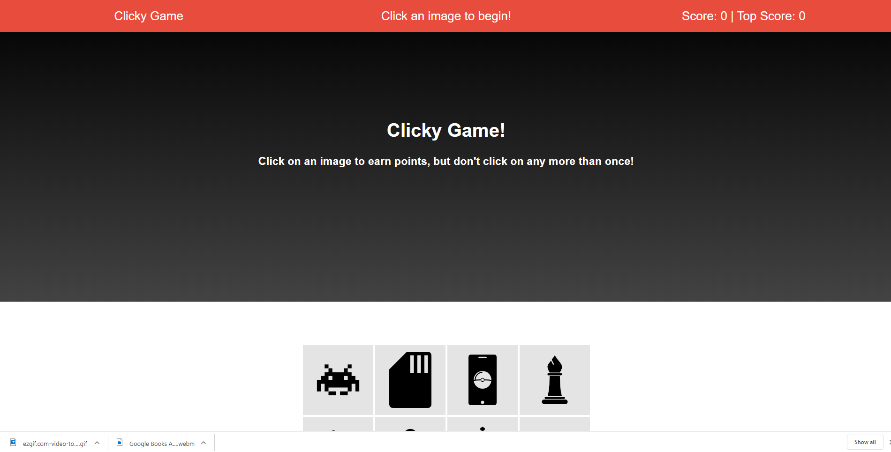
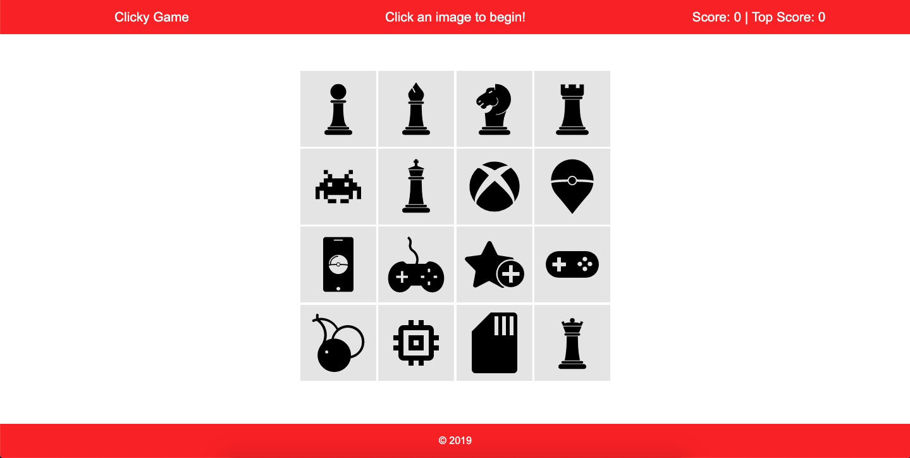
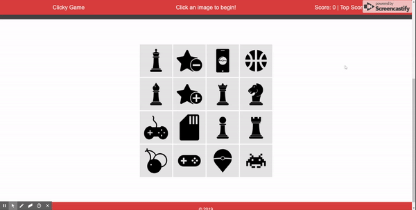

# clicky-game

[Go To App](https://romansenin.github.io/clicky-game/)

## Project Description

Clicky Game is a React memory card game. The user is first presented with a set of 16 cards (4x4):

When you click on a new card that you haven't previously clicked your score is increased by one. If you click on a card that has already been clicked, you have to restart from the beginning with your score resetting to 0.

The goal of the game is to find and click on a unique card each time in an effort to obtain the maximum score of 21.

An example is shown below:

For the first 15 click attempts, all of the cards that have already been clicked will stay inside the display square. Once the player achieves 16 correct cards, a card that hasn't been clicked from the remaining hidden set of 5 cards will replace a clicked card within the display square.

### Local Setup

1. Git clone or download zip folder.
1. Within the `/clicky-game` directory run `npm install`.
1. Run `npm start` and you should then be taken to a new browser tab ([http://localhost:3000](http://localhost:3000)) running the app.

## Technologies

React, CSS3
